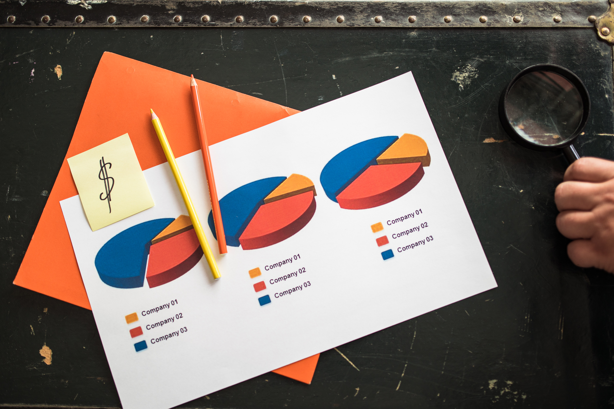

## Data Exploration



### Before starting, we are building one [Classification](./dataexpC.md) and [Regression](). First let's begin with classification.

**About Data**

In this we are selecting the data from kaggle namely [Spaceship Titanic](https://www.kaggle.com/competitions/spaceship-titanic/data) which is basically made for classification problem.

```python
# Importing essential libraries
import pandas as pd
import seaborn as sns
import matplotlib.pyplot as plt
```

**pandas** - It is used for data wrangling.

**seaborn** & **matplotlib** - It is used for plotting some visualisations.

### Let's see some description of columns our dataset has - 

**PassengerId**  A unique Id for each passenger. Each Id takes the form gggg_pp where gggg indicates a group the passenger is travelling with and pp is their number within the group. People in a group are often family members, but not always.

**HomePlanet** The planet the passenger departed from, typically their planet of permanent residence.

**CryoSleep** Indicates whether the passenger elected to be put into suspended animation for the duration of the voyage. Passengers in cryosleep are confined to their cabins.

**Cabin** The cabin number where the passenger is staying. Takes the form deck/num/side, where side can be either P for Port or S for Starboard.

**Destination** The planet the passenger will be debarking to.

**Age** The age of the passenger.

**VIP** Whether the passenger has paid for special VIP service during the voyage.

**RoomService**, **FoodCourt**, **ShoppingMall**, ***Spa**, **VRDeck** Amount the passenger has billed at each of the Spaceship Titanic's many luxury amenities.

**Name** The first and last names of the passenger.

**Transported** Whether the passenger was transported to another dimension. This is the target, the column you are trying to predict.


```python
#Download the dataset and use it locally from folder

#Importing data
df = pd.read_csv('spaceTrain.csv')
df = df.iloc[:,1:]    # Not including columns 'PassengerId'
df.head()
```
> We are not including 'PassengerId' column because it has unique value at each row or tuple i.e. so many values.
> Further we can also remove 'Cabin' and 'Name' column also, because they have also many values.

```python
# Displays basic information about dataset
df.describe()  # unique count of values, min of column, max of column etc..
```
> It analyzes information only about numerical columns

```python
# Numerical and categorical features
no_of_numerical_features = 0
no_of_categorical_features = 0
for feat in df.columns:
    if df[feat].dtypes!='O': no_of_numerical_features+=1
    else : no_of_categorical_features+=1
print(f'There are {no_of_numerical_features} numerical features and {no_of_categorical_features} categorical features')
```
> There are 7 numerical features and 6 categorical features

```python
# Missing Values in each independent variable
missing_values = pd.DataFrame({'Features':list(df.columns),'Missing Values':list(df.isnull().sum())})
```

> Above code displays the dataframe having all columns and their corresponding number of missing values present in it.

```python
# Let's plot missing values
plt.figure(figsize=(15,8))
sns.barplot(data = missing_values,x='Features',y='Missing Values')   # It will plot bars having height determining the number of missing values
```

```python
# Split the data in independent and dependent variable
features = df.drop(['Transported'],axis = 1)
target = df['Transported']

# Names of numerical and categorical features
numerical_features = [feat for feat in features.columns if features[feat].dtypes!='O']   
categorical_features = [feat for feat in features.columns if features[feat].dtypes=='O']
```
> Numerical Columns - [ 'Age', 'RoomService', 'FoodCourt', 'ShoppingMall', 'Spa', 'VRDeck' ]
> Categorical Columns - [ 'HomePlanet', 'CryoSleep', 'Cabin', 'Destination', 'VIP', 'Name' ]

```python
# Distribution of values in categorical features
plt.figure(figsize=(12,12))
def label_function(val):
    return f'{val / 100 * len(df):.0f}\n{val:.0f}%'
j=1
for i in categorical_features:
    plt.subplot(3,2,j)
    df.groupby(i).size().plot(kind='pie', autopct=label_function, textprops={'fontsize': 12})
    j+=1
```
> Above code displays the distribution of values of every columns through pie chart

**Correlations are also an important measure to identify the relation between each column**

```python
# Correlation between each feature
correlations = features.corr()
correlations
```

> Columns which have less relation value(near to 0), can be removed also

```python
# Visualize the correlation using heatmap
sns.heatmap(correlations)
```

### Now, we also need to detect and visualize outliers using boxplot

```python
## For numerical features
plt.figure(figsize=(12,12))
i=1
for feat in numerical_features:
    plt.subplot(3,2,i)
    sns.boxplot(df[feat])
    i+=1
```

**View on [Github](https://github.com/Hg03/Classification)**


