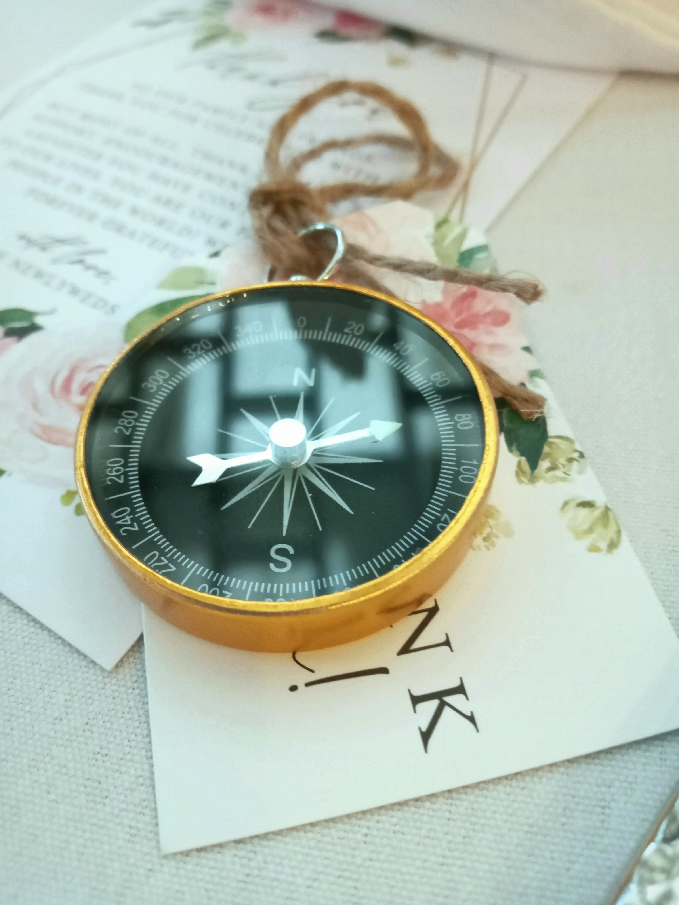

## Data Exploration



### Let's go ahead with Regression problems

**About Data 💽**

In this we are selecting the data from kaggle namely [Car Prices Datset](https://www.kaggle.com/datasets/hellbuoy/car-price-prediction) which is basically made for regression problem.

**Let begin 👨‍💻**

```python
# Importing essential libraries
import pandas as pd
import seaborn as sns
import matplotlib.pyplot as plt
```
**pandas** - It is used for data wrangling.

**seaborn** & **matplotlib** - It is used for plotting some visualisations.

> Take a brief look at the dataset and learn the description on each column.

```python
# Reading data
df = pd.read_csv('data.csv')
df.drop('car_ID',axis=1,inplace=True)
# Split in feature and target for future purpose
features = df.drop('price',axis=1)
target = df.price

# Names of numerical and categorical features
numerical_features = [col for col in features.columns if features[col].dtypes!='O']
categorical_features = [col for col in features.columns if col not in numerical_features]
```
**Names of numerical and categorical features**

```python
print(f'Numerical Features \n {numerical_features}, \nCategorical Features \n {categorical_features}')
```
> Numerical Features -  ['symboling', 'wheelbase', 'carlength', 'carwidth', 'carheight', 'curbweight', 'enginesize', 'boreratio', 'stroke', 'compressionratio', 'horsepower', 'peakrpm', 'citympg', 'highwaympg']


> Categorical Features - ['CarName', 'fueltype', 'aspiration', 'doornumber', 'carbody', 'drivewheel', 'enginelocation', 'enginetype', 'cylindernumber', 'fuelsystem', 'price']

**Getting the basic information about dataset  like count, min, max, 25 - 50 - 75 quantile.**
```python
df.describe()
```
**Let's look at the number of null values in each columns**
```python
# Great !! we have no null values
df.isnull().sum()
```
**Let's plot kernel distribution for numerical features**

```python
plt.figure(figsize=(20,40))
j=1
for i in numerical_features:
    plt.subplot(7,2,j)
    sns.kdeplot(df[i])
    j+=1

# Not every feature's distribution is normal, so we'll handle it using feature scaling
```

**Let's look at the distribution of categories in categorical features**

```python
plt.figure(figsize=(38,38))
def label_function(val):
    #return f'{val / 100 * len(df):.0f}\n{val:.0f}%'
    return f'{val:.0f}%'
j=1
for i in categorical_features:
    plt.subplot(11,1,j)
    df.groupby(i).size().plot(kind='pie', autopct=label_function, textprops={'fontsize': 12})
    j+=1
```
> From above code, we can see that CarName has lots of categories so we can ignore it (useless column)

**Bar plot distribution of categorical features 📊**
```python
plt.figure(figsize=(38,38))
j=1
for i in categorical_features:
    if(i == 'price'):
        break
    plt.subplot(5,2,j)
    sns.barplot(data = df,x=i,y='price')
    j+=1
```

**Feature correlation is also important aspect in featue engineering, therefore we can visualize it heatmap of correlation 🗺️**

```python
sns.heatmap(df.corr())
```

**Note - Less descriptive because all the steps are kinda similar**

**View on [Github](https://github.com/Hg03/Regression)**