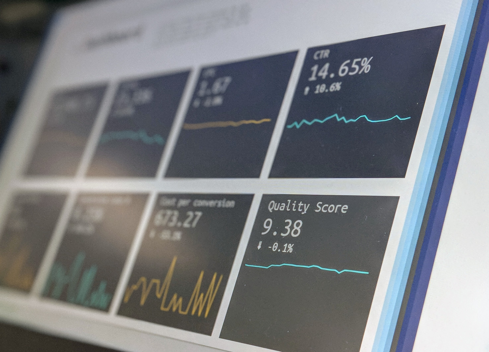

## About Data

Machine learning model's fuel is data. There can many types of data through which we can find relations like

* [Numerical Data](https://archive.ics.uci.edu/ml/datasets/wine) (like [23,45,1,22,3,0056] etc)
* [Textual / Categorical Data](https://www.kaggle.com/datasets/goelyash/disney-hotstar-tv-and-movie-catalog) (like desinations ['CEO','Assistant Manager'] etc)
* [Image Data](https://www.kaggle.com/datasets/die9origephit/nike-adidas-and-converse-imaged) in form of pixels (like img = [[0,1,0,34,655.....],[34,56,1,1....]] etc)
* Video format Data (Here we deal videos as a group of millions of images)
* [Voice Data](https://www.kaggle.com/datasets/primaryobjects/voicegender) (like frequency, amplitude)
* [Hybrid data](https://www.kaggle.com/datasets/ruchi798/data-science-job-salaries) (Mixture of everything)

If we take about data, we have its significant part which is **Independent Variables** and **Dependent Variables**.

* **Independent Variables** - These are the values on which machine learning model finds the relations and train and predict what ??.
* **Dependent Variables** - These are the values which varies according to independent variables i.e. they depends on independent variables.
* **For example** :- There is a data in which machine has to learn through data that it is male or female.
  
  |S.no.|hair_length(in cm)|height(in cm)|voice_pitch(in hz)|gender|
  |-----|-----------|------|-----------|------|
  |1|20|155|10|'Female'|
  |2|4|140|28|'Male'|
  |3|8|150|15|'Male'|

Here, **hair_length**, **height**, **voice_pitch** are the independent variables and **gender** is the dependent variable.

Here **independent variable** can also called **Features** and **dependent variable** to be **target**.

### Types Of ML problems

As we to learn machine needs data, but data can be in two forms i.e. 
* Data with target variable (Supervised Learning)
* Data without target variable (Unsupervised Learning)

When we've to create the ml model based on data which have output / target, it's somewhat easy to create as compared to data without target.

### Supervised Learning

In this type of learning, presence of target in data is mandatory. Let's take two examples on which we further classify supervised learning.

**Example no.1** - Assume there are patients in an hospital, and our model needs to predict their blood pressure rate according to given data.

**Data** - 

|Activity_hours|Sweet_consumption|Is_depressed|BMI|Sex|Blood_pressure|
|--------------|-----------------|------------|---|---|--------------|
|2|2|0|79|'M'|90|
|3|3|1|88|'F'|145|
|1|4|1|102|'M'|130|
|5|5|0|100|'M'|100|

Here **Blood_pressure** is the target variable. We can see that value in target variable is kinda continuous it can be anything like 90 ,91,102.5,107, it's not a discrete like only falls in 20,30,40 for example. 

So whenever we encounter the ml problems in which we have to predict the value which is continuous in nature, we can call them **Regression Problem**.

**Example no. 2** - Lets extend the above dataset and our machine learning model wants to predict that the patient has thyroid or not.

**Data** - 

|Activity_hours|Sweet_consumption|Is_depressed|BMI|Sex|Blood_pressure|has_thyroid|
|--------------|-----------------|------------|---|---|--------------|-----------|
|2|2|0|79|'M'|90|0|
|3|3|1|88|'F'|145|1|
|1|4|1|102|'M'|130|1|
|5|5|0|100|'M'|100|0|

Here **has_thyroid** is the target variable. We can see that we only have to predict that patient has thyroid or not i.e. 0 means no thyroid and 1 means has thyroid.

So whenever we encounter ml problems in which we have to predict the value which is discrete in nature, we call them **Classification Problem**.

### Unsupervised Learning

Now, you are playing blindly in machine learning game, you've given the data which have no label. So what we have to predict ???

That's why supervised learning is quite doable as compared with unsupervised learning. In unsupervised learning, we have the data and should try to combine the sub-part of data which have some similar relations which we called classes. So to separate our data in some classes (randomly names class 1,2 etc) is the phenomena of **Clustering**.

**Example** - Assume we have given data in form of images of dogs,cats and cows.

Data - 

       🐮 🐕 🐱 🐮 🐱 🐕 🐕 🐱 

Now ,our machine learning model don't know what cow,dog or cat is, and even data doesn't have target. So it separates our data into classes(concept of clustering) which it names as 0,1,2 where

**0** classifies images of dogs 🐕 🐕 🐕

**1** classifies images of cats 🐱 🐱

**2** classifies images of cows 🐮

**Hope you understand the types of machine learning tasks !!!**
